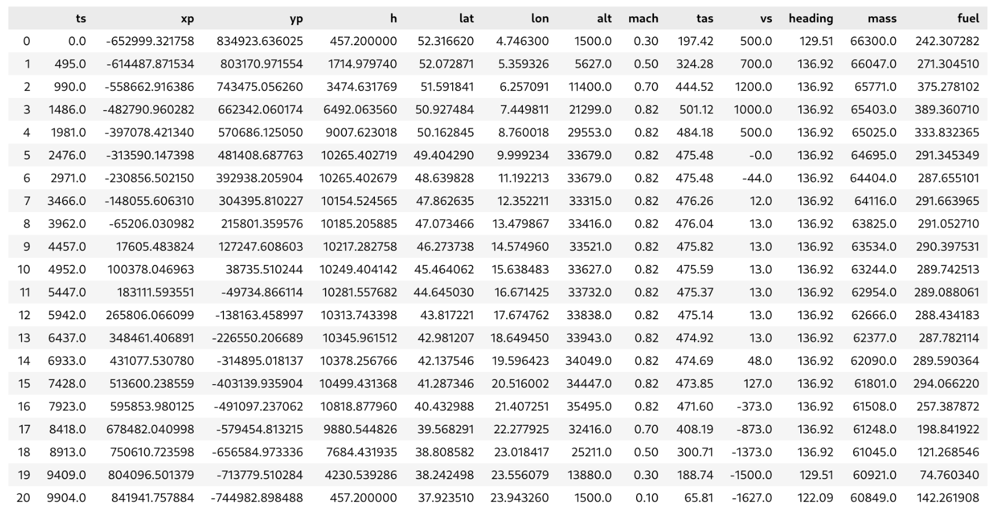

# OpenAP Trajectory Optimizer

This repository contains the flight trajectory optimizer module based on the [OpenAP](https://github.com/junzis/openap) package. 

This tool uses non-linear optimal control direct collocation algorithms from the `casadi` library. It provides simple interfaces to generate different optimal trajectories. For example, this tool can generate any of the following trajectories (or combinations thereof):

- Complete flight trajectories or flight segments at different flight phase
- Fuel-optimal trajectories
- Wind-optimal trajectories
- Cost index optimized trajectories
- Trajectories optimized using customized 4D cost functions (contrails, weather)
- Flight trajectories with constraint altitude, constant mach number, etc.

What's more, you can also design your own objective functions and constraints to optimize the flight trajectory.


## 🕮 User Guide

A more detailed user guide is available in the OpenAP handbook: <https://openap.dev/optimize>.


## Install

1. Install from PyPI:

```sh
pip install --upgrade openap-top
```

2. Install the development branch from GitHub (also ensures the development branch of `openap`):

```sh
pip install --upgrade git+https://github.com/junzis/openap
pip install --upgrade git+https://github.com/junzis/openap-top
```

The `top` package is an extension of `openap` and will be placed in the `openap` namespace.

## Quick Start

### A simple optimal flight

The following is a piece of example code that generates a fuel-optimal flight between two airports, with a take-off mass of 85% of MTOW:

```python
from openap import top

optimizer = top.CompleteFlight("A320", "EHAM", "LGAV", m0=0.85)

flight = optimizer.trajectory(objective="fuel")
```

Other predefined objective functions are available, for example:

```python
# Cost index 30 (out of max 100)
flight = optimizer.trajectory(objective="ci:30") 

# Global warming potential over 100 years
flight = optimizer.trajectory(objective="gwp100")

# Global temperature potential over 100 years
flight = optimizer.trajectory(objective="gtp100") 
```

The final `flight` object is a Pandas DataFrame. Here is an example:



### Using Wind Data

To include wind in our optimization, first download meteorological data in `grib` format from ECMWF, such as the ERA5 reanalysis data.

Once grid files are ready, we can read and enable wind for our optimizer with this example code:

```python
from openap import top


fgrib = "path_to_the_wind_data.grib"
windfield = top.tools.read_grids(fgrib)

optimizer = top.CompleteFlight("A320", "EHAM", "LGAV", m0=0.85)
optimizer.enable_wind(windfield)

flight = optimizer.trajectory() # default objective is fuel
```

Next, we can visualize the trajectory with wind barbs:

```
top.vis.trajectory(flight, windfield=windfield, barb_steps=15)
```


